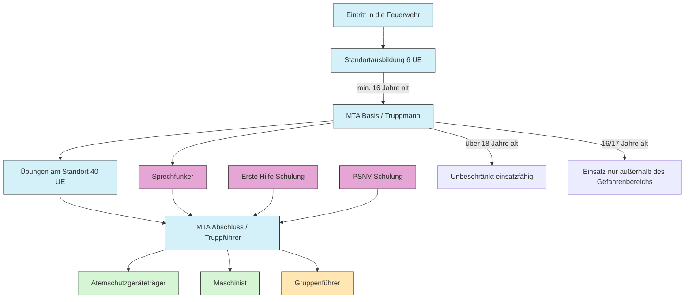
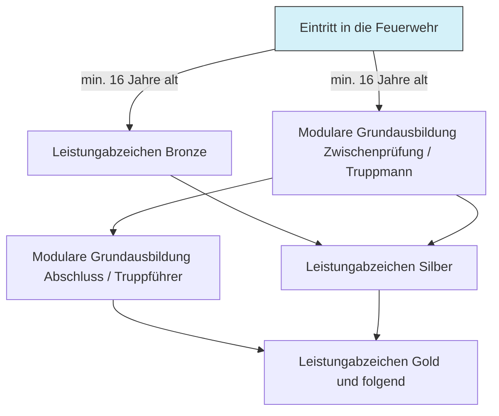

# Ausbildung in der Feuerwehr

## Grundausbildung

---

## Lehrgänge im Landkreis

https://www.feuerwehr-ndsob.de/ausbildung/

- MTA - Modulare Truppausbildung (Modul I und II)
- Digitalfunkausbildung
- PSNV-E
- Maschinistenausbildung
- Ausbildung zum Atemschutzgeräteträger
- Schaumausbildung
- Motorsägenausbildung
- Gruppenführerfortbildung  (empfohlen ab ca 2-4 Jahren Einsatzerfahrung)

Anmeldung unter https://mpfeuer-vp.webservices.mpsoft4u.info/neuburgschrobenhausen/ über die Kommandanten und den Jugendwart

## Lehrgänge an der Feuerwehrschule

Lehrgangsplätze an den Feuerwehrschule sind sehr begrenzt, von Interesse für uns ist größtenteils

- Brandhaus
- Gruppenführer
- Gerätewart
- Leiter Atemschutz
- Leiter Feuerwehr
- Aufbaulehrgang für Kommandanten mit Gruppenführerqualifikation (empfohlen ab ca 2-4 Jahren Einsatzerfahrung)

Landkreisplätze: https://www.feuerwehr-ndsob.de/informationen/aktuelles/lehrgangsplatzverteilung-2026/

Angebot: https://www.sfsr.de/lehrgaenge/lehrgangsangebot
Freie Plätze: https://www.bms-fw.bayern.de/Navigation/Public/LastMinute.aspx

Anmeldung über den Kommandanten.

## Selbststudium und Lehrgangsvorbereitung

https://feuerwehr-lernbar.bayern/

---

## Aktuelle Themen

### Brandwacht Bayern

https://www.brandwacht.bayern.de/

### Atemschutzunfälle

https://www.atemschutzunfaelle.de/

## LFV Bayern

https://www.lfv-bayern.de/aktuelles/

---

# Verwaltungsvorgänge

## Eintritt

Der Eintritt in den Feuerwehrdienst erfolgt per Handschlag durch den Kommandanten.
siehe [Satzungen und Verodnungen des Marktes Rennertshofen](https://www.rennertshofen.de/Satzungen-und-Verordnungen.n33.html) Feuerwehrsatzung  §4 (Fassung von 1992)
und [BayFwg Art.6](https://www.gesetze-bayern.de/Content/Document/BayFwG-6)

Der Eintritt in den Verein erfolgt über Abgabe des Mitgliedsantrag an den Kassier oder den Vorstands.

## Austritt

// TODO

---

# Abnahmen

## Aktive

### Leistungsabzeichen Löschen

Die Abnahme des Leistungsabzeichen löschen erfolgt alle 2 Jahre,
wenn eine Gruppe zusammenkommt.

### Krawattenschieber

Die Leistungsprüfung „Krawattenschieber“ ist eine feuerwehrspezifische Auszeichnung für erfahrene Einsatzkräfte ab 40 Jahren im Landkreis Neuburg-Schrobenhausen. Sie wird als feuerwehrinterne Leistungsprüfung (ähnlich Gold-Rot) von den örtlichen Kreisfeuerwehren abgenommen. \[[1](https://www.feuerwehr-ndsob.de/ausbildung/leistungsprufung/)]

- **Zielgruppe:** Aktive Feuerwehrdienstleistende ab dem Mindestalter von 40 Jahren, die bereits andere Leistungsprüfungen abgeschlossen haben. \[[1](https://www.feuerwehr-ndsob.de/ausbildung/leistungsprufung/)]
- **Voraussetzungen:** Basiert auf der Leistungsprüfung Gold-Rot mit einer Wartezeit von 2 Jahren und erfordert eine Mindestteilnehmeranzahl von 5 Personen. \[[1](https://www.feuerwehr-ndsob.de/ausbildung/leistungsprufung/)]
- **Organisation:** Die Abnahme erfolgt über die [Kreisbrandinspektion Neuburg-Schrobenhausen](https://www.feuerwehr-ndsob.de/ausbildung/leistungsprufung/) durch Schiedsrichter im Landkreis. \[[1](https://www.feuerwehr-ndsob.de/ausbildung/leistungsprufung/)]

## Jugend

### Bayrische Jugendleistungsabzeichen

### Deutsches Jugendleistungsabzeichen

### Jugendflamme

### Wissenstest
