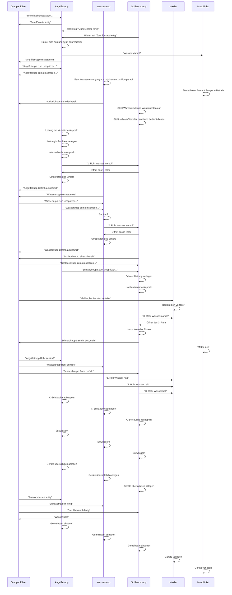

# Vorbereitung vor der Umseztung

- [ ] Hydrant vorbereitet
  - [ ] Fast ganz aufgedreht
  - [ ] Blinddeckel leicht zu lösen
- [ ] Schlauchtragekörbe mit 2 Schläuchen befüllt
- [ ] Fahrzeug
  - [ ] Fenster geschlossen
  - [ ] Rolläden geschlossen
  - [ ] Halterungen frei von Hindernissen
  - [ ] Warndreiecke aus der Verpackung

# Löschübung

## Aufgaben der Trupps

### Angriffstrupp

Setzt den Verteiler und rüstet sich mit Tragekorb, Licht, Strahlrohr aus.

Weil nun ein Schnellangriffverteiler verwendet wird, gibt er nun "Wasser Marsch" an den Maschinisten

Löschaufbau 1.Rohr

### Wassertrupp

Aufbau der Leitung vom Oberflurhydranten zum Fahrzeug
Aufbau der Leitung vom Fahrzeug zum Verteiler

Löschaufbau 2.Rohr

### Schlauchtrupp

Sichern der Einsatzstelle (Warndreieck und Blinklicht)
Verteiler bedienen für Angriffstrupp und Wassertrupp

Löschaufbau 3.Rohr

### Machinist

Fahrzeug sichern (Warnblinker, Blaulicht) und Pumpe bedienen

### Melder

Beim Gruppenführer bleiben und den Verteiler für den Schlauchtrupp bedienen.

### Gruppenführer

Befehle geben und schön ausstehen.

## Befehle

### Gruppenführer

Brand eines Nebengebäudes,
keine Menschen und Tiere in Gefahr
Wasserentnahmestelle aus Oberflurhydrant hinterm Feuerwehrhaus
Lage des Verteilers an die markierte Stelle”
„Schlauchtrupp
zum Absichern der Einsatzstelle
mit Warndreiecken und Warnleuchten
je 30 m vor dem Löschfahrzeug und
dem Oberflurhydranten“
„Zum Einsatz fertig!“

### Angriffstrupp

wiederholt "Zum Einsatz fertig"

> Angriffstrupp
> zum Umspritzen des **linken** Eimers
> mit dem **1**. Rohr
> zur **linken** markierten Linie
> über den Platz
> vor!

### Wassertrupp

> Wassertrupp
> zum Umspritzen des **rechten** Eimers
> mit dem **2**. Rohr
> zur **rechten** markierten Linie
> über den Platz
> vor!

### Schlauchtrupp

> Schlauchtrupp
> zum Umspritzen des **mittleren** Eimers
> mit dem **3**. Rohr
> zur **mittleren** markierten Linie
> über den Platz
> vor!

## Ablaufplan löschen

# Zusatzaufgaben

| Stufe     | Aufgabe                                   |
| --------- | ----------------------------------------- |
| 3(Gold)   | Gerätekunde                               |
| 4(G-Blau) | Erste Hilfe                               |
| 5(G-Grün) | Erkennen von Gefahrgut und Hinweiszeichen |
| 6(G-Rot)  | Testfragen                                |

# Knoten und Stichen

|               | Knoten                     | Zeit |
| ------------- | -------------------------- | ---- |
| Angriffstrupp | Rettungsknoten             | 40 s |
| Wassertrupp   | Halbmastwurf an Haltegurt  | 15 s |
| Schlauchtrupp | C-Strahlrohr zum aufziehen | 15 s |
| Maschinist    | Zimmermannschlag           | 15 s |
| Melder        | Mastwurf mit Spierenstich  | 15 s |
| Gruppenführer | Fragenkatalog              |      |
